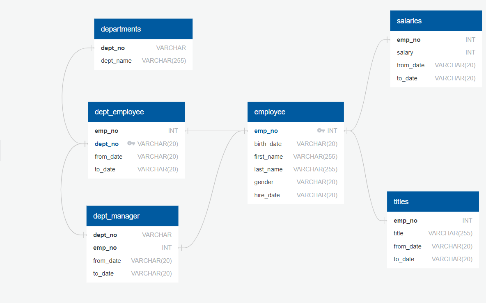
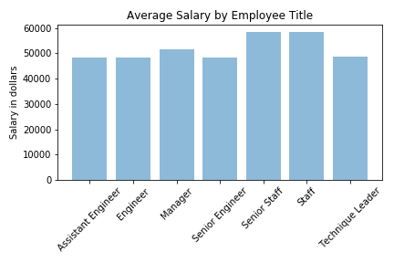

# Employee Records SQL

For this project I created the ERD tables for a group of Employee record CSVs, imported the CSVs into a SQL database, and created numerous queries on the data. In other words:

1. Data Modeling
2. Data Engineering
3. Data Analysis

#### Data Modeling

Inspect the CSVs and sketch out an ERD of the tables. Using [http://www.quickdatabasediagrams.com](http://www.quickdatabasediagrams.com).

#### Data Engineering

* Create a table schema for each of the six CSV files. Including specific data types, primary keys, foreign keys, and other constraints.

* Import each CSV file into the corresponding SQL table.

#### Data Analysis

With a complete database, I designed mulitple SQL queries of the data (see MainCode.sql)

Then imported data into a Pandas DataFrame using Jupyter Notebook to create visual of Average Salaries.

**Tools**

* ERD design with [http://www.quickdatabasediagrams.com](http://www.quickdatabasediagrams.com).

* SQL and PostgreSQL database.

* Python Libraries: Pandas, sqlalchemy.

**ERD Image and Analysis BarChart**

